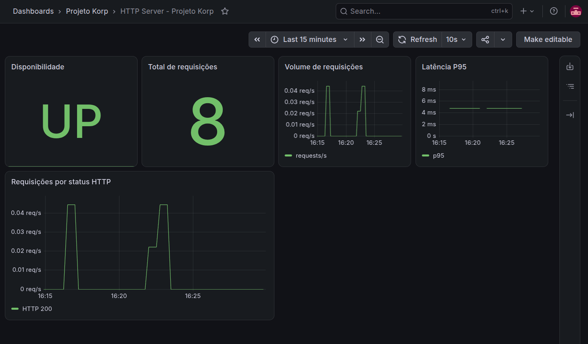

# HTTP Server — Projeto Korp

Implementação do desafio técnico DevOps da Korp, com foco em containerização, automação de infraestrutura e observabilidade.

A solução disponibiliza uma API HTTP escrita em Go através de um reverse proxy NGINX, executada em containers Docker e monitorada com Prometheus e Grafana. O provisionamento do ambiente é automatizado com Ansible.

**Autor:** Jacivaldo Carvalho  
**Engenheiro de Telecomunicações | DevOps | SRE | Cloud**

## Arquitetura

```text
                         Host Linux
                             |
                           :80
                             |
                         +-------+
                         | NGINX |
                         +---+---+
                             |
                        korp-backend
                             |
              +--------------+--------------+
              |                             |
       +------v------+               +------v------+
       | Go HTTP API |<--------------| Prometheus  |
       |    :8080    |    scrape     |    :9090    |
       +-------------+               +------+------+
                                            |
                                            v
                                     +-------------+
                                     |   Grafana   |
                                     |    :3000    |
                                     +-------------+
```

Somente o NGINX é exposto externamente. Prometheus e Grafana são publicados apenas em `127.0.0.1`.

## Stack

- Go
- Docker / Docker Compose
- NGINX
- Prometheus
- Grafana
- Ansible

## API

### `GET /projeto-korp`

```bash
curl http://localhost/projeto-korp
```

Resposta:

```json
{
  "nome": "Projeto Korp",
  "horario": "2026-09-11T19:16:12Z"
}
```

O horário é gerado dinamicamente em UTC.

### Métricas

A aplicação expõe métricas Prometheus internamente em:

```text
/metrics
```

São monitorados disponibilidade, volume de requisições, status HTTP e latência.

## Execução com Docker Compose

```bash
docker compose up -d --build
```

Validar:

```bash
docker compose ps
curl http://localhost/projeto-korp
```

Serviços locais:

| Serviço | Endpoint |
|---|---|
| API | `http://localhost/projeto-korp` |
| Grafana | `http://localhost:3000` |
| Prometheus | `http://localhost:9090` |

## Provisionamento com Ansible

Instale a collection necessária:

```bash
ansible-galaxy collection install -r ansible/requirements.yml
```

Execute o provisionamento:

```bash
ansible-playbook \
  -i ansible/inventory/hosts.ini \
  ansible/site.yml \
  --ask-become-pass
```

O playbook executa três etapas:

```text
docker   -> instala e configura Docker/Compose
deploy   -> realiza o deploy da stack
validate -> valida API, Prometheus e Grafana
```

A automação foi construída para ser idempotente. Em um ambiente já convergido, uma nova execução não realiza alterações desnecessárias.

## Observabilidade

O Prometheus coleta as métricas da aplicação diretamente pela rede Docker.

O Grafana é provisionado automaticamente com datasource Prometheus e dashboard contendo:

- disponibilidade da aplicação;
- total e volume de requisições;
- latência P95;
- requisições por status HTTP.
  


## Segurança

A solução aplica algumas práticas de hardening:

- aplicação executada como usuário não-root;
- imagem final Distroless;
- filesystem da aplicação somente leitura;
- capabilities removidas do container da aplicação;
- `no-new-privileges`;
- porta `8080` não publicada no host;
- endpoint `/metrics` não exposto pelo NGINX;
- Prometheus e Grafana limitados a `127.0.0.1`.

## Estrutura

```text
.
├── ansible/                 # Provisionamento e validação
├── cmd/server/              # Entry point da aplicação Go
├── internal/
│   ├── httpapi/             # Handler HTTP e testes
│   └── observability/       # Métricas Prometheus
├── grafana/                 # Dashboard e provisioning
├── nginx/                   # Reverse proxy
├── prometheus/              # Configuração de scraping
├── compose.yml
├── Dockerfile
├── go.mod
└── README.md
```

## Validação

```bash
go test ./...
go vet ./...
docker compose config

ansible-playbook \
  -i ansible/inventory/hosts.ini \
  ansible/site.yml \
  --syntax-check
```

O ambiente é considerado saudável quando a API responde em `/projeto-korp`, o target da aplicação está `UP` no Prometheus e Grafana/Prometheus passam nas verificações executadas pelo Ansible.